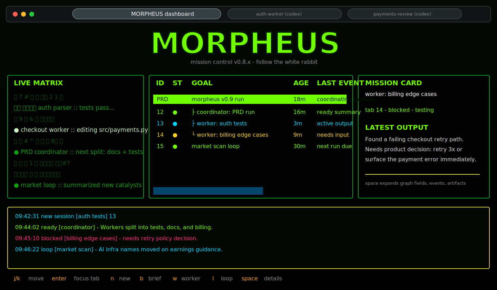
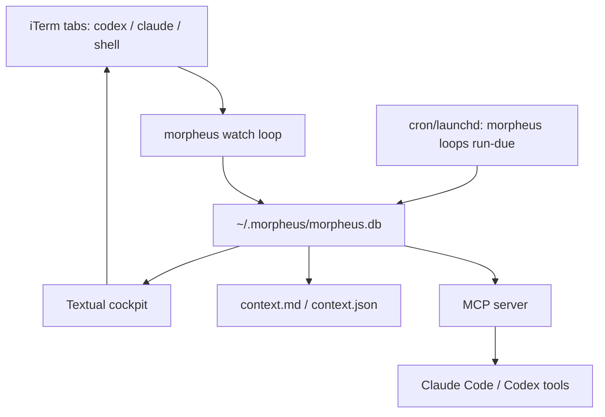

```
        ███╗   ███╗ ██████╗ ██████╗ ██████╗ ██╗  ██╗███████╗██╗   ██╗███████╗
        ████╗ ████║██╔═══██╗██╔══██╗██╔══██╗██║  ██║██╔════╝██║   ██║██╔════╝
        ██╔████╔██║██║   ██║██████╔╝██████╔╝███████║█████╗  ██║   ██║███████╗
        ██║╚██╔╝██║██║   ██║██╔══██╗██╔═══╝ ██╔══██║██╔══╝  ██║   ██║╚════██║
        ██║ ╚═╝ ██║╚██████╔╝██║  ██║██║     ██║  ██║███████╗╚██████╔╝███████║
        ╚═╝     ╚═╝ ╚═════╝ ╚═╝  ╚═╝╚═╝     ╚═╝  ╚═╝╚══════╝ ╚═════╝ ╚══════╝

                   mission graph cockpit for parallel agents
```

Morpheus is a terminal-native cockpit for running many `codex`, `claude`, and
shell sessions in iTerm without losing the plot. It watches live tabs, updates
their titles, keeps a Matrix-style dashboard, and now stores a durable mission
graph so an old session can answer: why does this exist, what happened, what is
blocked, what proof exists, and what should happen next?

## Quickstart

Requirements:

- macOS
- iTerm2
- Python 3.10+
- iTerm2 Python API enabled: `iTerm2 -> Settings -> General -> Magic -> Enable Python API`

From the repo:

```bash
cd ~/github/fabianbaier/morpheus
make start
```

`make start` does three things:

1. Creates `.venv` if needed.
2. Installs this checkout in editable mode with `pip install -e .`.
3. Installs/reloads the launchd daemon from `.venv/bin/morpheus`, then opens the
   Morpheus cockpit.

That means the command always runs the latest code you are editing in this repo,
not a stale global install.

Useful Make targets:

```bash
make start          # reload daemon, then open the cockpit
make dashboard      # open cockpit only
make install-cli    # install a user PATH shim for running morpheus anywhere
make daemon         # install/reload launchd watcher from this checkout
make status         # daemon health, PID, last beacon, log path
make watch          # foreground watcher instead of launchd
make graph-status   # mission graph table counts and health checks
make doctor         # iTerm2 Python API diagnostic
make logs           # tail ~/.morpheus/daemon.log
make test           # install editable, compileall, unit tests, whitespace check
```

Override the daemon poll interval when testing:

```bash
make start POLL=2
```

Install the local CLI for other terminals:

```bash
make install-cli
```

This creates `~/.local/bin/morpheus` as a shim to this repo's editable
`.venv/bin/morpheus`. You do not need to activate the venv; launch `morpheus`
from any worktree and Morpheus will use that terminal's current directory as
the dashboard cwd and PRD/source-file picker fallback. If `~/.local/bin` is not
on your `PATH`, the target prints the exact `export PATH=...` line to add.

## Daily Use

Morpheus is meant to be your **home tab** while many agent tabs run around it.
Start here, watch what is happening, then jump into a real iTerm tab only when a
session needs your hands.



Start the cockpit from any worktree:

```bash
morpheus
```

### What You See

The cockpit has four main areas:

- **Startup intro** - A skippable Matrix boot sequence with terminal Earth,
  rain, and sunglasses. IP geolocation is on by default for the Earth lock-on;
  opt out with `MORPHEUS_INTRO_GEO=0`, `MORPHEUS_NO_INTRO=1`, or
  `[intro] geolocation = false` in `~/.morpheus/config.toml`.
- **Left: live Matrix stream** - A rain view made from recent terminal output
  across active sessions. The selected session and urgent sessions show up more
  brightly.
- **Middle: mission table** - The list of live tabs, PRD runs, coordinators,
  workers, and loops. PRD runs appear as parent rows with child sessions nested
  underneath.
- **Right: mission card** - The selected session's latest useful output first,
  then optional mission metadata, events, and artifacts.
- **Bottom: ticker** - Newest-first headlines for spawns, blocked prompts,
  collisions, notes, loop results, and ready/completed session summaries.

### Normal Flow

1. Open Morpheus and keep it as the cockpit tab.
2. Press `n` to start a new agent session. Give it a goal and command, such as
   `codex`.
3. Watch the mission table and ticker. The newest useful events appear first.
4. Move with `j`/`k` or the arrow keys.
5. Press `Enter` when you want to jump into the real iTerm tab and respond.
6. Return to Morpheus when you want the overview again.

### PRD Runs

If you start a session from a Markdown source file, Morpheus creates a PRD run:

- The PRD run is a virtual parent row, not an extra iTerm tab.
- The coordinator tab owns the plan and status.
- Worker tabs sit under that parent so the work stays grouped.
- Press `w` on a PRD parent or coordinator to spawn a manually scoped worker.
- Press `d` on a PRD parent to archive the run and close live child tabs.
- Press `p` to prune orphan parent rows with no live children.

### Loops

Press `l` to create a recurring prompt loop. Loops are useful for repeated
checks such as "scan for new blockers every 30 minutes" or "summarize market
catalysts." Loop results show up in the ticker, and targeted loops also attach
events/artifacts to the selected mission. Project loops appear as `LOOP` rows
in the cockpit; use `Shift+L` or `L` to manage them.

### Key Shortcuts

| Key | Action |
|---|---|
| `j` / `k` or arrows | Move selection |
| `Enter` | Focus the selected real iTerm tab |
| `n` | New session |
| `w` | New worker under a PRD run |
| `l` | New recurring prompt loop |
| `Shift+L` / `L` | Manage loops |
| `b` | Brief the selected mission from graph + transcript |
| `e` | Edit mission memory |
| `space` | Expand/collapse mission card details |
| `t` | Switch project scope |
| `o` | Toggle PRD tree open/closed |
| `r` | Snapshot and resume in a fresh tab |
| `/` | Add a note |
| `d` | Kill/archive selected session or PRD run |
| `p` | Prune stale/orphan rows |

Core commands:

```bash
morpheus spawn "PR #224 review" "codex"
morpheus list
morpheus snapshot <tab-prefix>
morpheus prune
morpheus brief
morpheus ask "what needs my attention?"
morpheus activity --all
morpheus graph status
morpheus graph show <mission-or-tab-prefix>
morpheus graph recall-eval <mission-or-tab-prefix>
morpheus run find-prds .
morpheus run start ./PRD.md --cmd "codex"
morpheus loops add "market scan" "summarize tomorrow's market catalysts" --every 30m
morpheus loops run-due
morpheus mcp serve
```

Cross-session notes:

```bash
morpheus context -f short
morpheus activity -f short
morpheus note "touching src/auth/*, hold off"
morpheus note --kind claim "claiming PR #224 worktree"
morpheus note --kind broadcast "please verify remote commits before finishing"
morpheus notes -n 20
```

`morpheus note --kind broadcast` does both kinds of delivery: it writes the
shared context and types the message into live iTerm sessions. Use `--stage` to
type without pressing Enter, `--target <tab-or-mission-prefix>` to limit
delivery, or `--context-only` for a passive note.

Suggested `AGENTS.md` / `CLAUDE.md` snippet for repos you work on in parallel:

```markdown
## Other sessions
Before editing files, run `morpheus context -f short` to see what other
agents are doing. If you would collide, post a `morpheus note --kind claim`
first or switch worktrees.
```

## Architecture



Runtime pieces:

- `morpheus/core.py` polls iTerm every few seconds, detects state, updates tab
  titles, writes context files, and records live sessions.
- `morpheus/dashboard.py` renders the Textual cockpit with Matrix rain output
  shards, mission table, selected mission card, alerts, and keyboard actions.
- `morpheus/daemon.py` installs a launchd watcher so tab titles and context stay
  fresh even when the cockpit is closed.
- `morpheus/db.py` owns SQLite storage for live session attachments, notes,
  ledgers, and the v0.7 mission graph tables.
- `morpheus/mission_graph.py` resolves mission IDs/tab IDs and provides graph
  health helpers.
- `morpheus/prd_runs.py` finds PRDs/specs and creates coordinator-led parent
  missions for v0.8 PRD Runs.
- `morpheus/loops.py` runs due prompt loops, captures output under
  `~/.morpheus/loops/`, and publishes ticker notes plus graph artifacts.
- `morpheus/context.py` writes `~/.morpheus/context.md` and `.json` so agents can
  see sibling sessions.
- `morpheus/mcp_server.py` exposes sessions, mission graph read/update tools,
  notes/claims, spend, and action history to Claude Code / Codex via MCP.

## Mission Graph

v0.6 tracked live tab rows in `missions`. The first v0.7 phase adds durable graph
storage:

- `missions` is now the live iTerm attachment table and includes `mission_id`.
- `mission_memory` stores durable recall fields: title, phase, why, plan, next
  step, blocker, provenance, confidence, topic, and archive state.
- `mission_events` is an append-only timeline of decisions, blockers, summaries,
  checks, archives, and resumes.
- `mission_artifacts` stores proof and outputs: snapshots, tests, builds, PRs,
  issues, docs, logs.
- `mission_edges` links missions, topics, artifacts, files, PRs, and decisions.
- `prompt_loops` and `prompt_loop_runs` store recurring prompts, due times,
  captured output, ticker summaries, and target mission routing.

Inspect it:

```bash
morpheus graph status
morpheus graph show <tab-prefix-or-mission-id>
morpheus graph event <ref> "decided to split auth tests" --kind decision
morpheus graph artifact <ref> ./pytest.log --kind test --status pass
morpheus graph recall-eval <ref>
```

The MCP server exposes the same graph layer to agents through
`list_missions`, `get_mission`, `update_mission`, `add_mission_event`,
`add_mission_artifact`, and `link_missions`. These tools can update mission
memory and proof, but they do not spawn, kill, push, merge, or send external
messages.

Snapshots automatically attach a `snapshot` artifact to the selected mission.
When a tab is closed or disappears, the live attachment is removed but the
mission memory is archived instead of forgotten.

### 48-Hour Recall Eval

`morpheus graph recall-eval` checks whether stale mission graph data has enough
local context for the `b` mission brief to recover intent and next action within
the 10-second dogfood target. It scores stale age, why, done definition,
acceptance criteria, next step, recent decision, recent check, and proof
artifact fields.

```bash
morpheus graph recall-eval <mission-or-tab-prefix>
morpheus graph recall-eval --include-archived --record-event
morpheus graph recall-eval --json <mission-or-tab-prefix>
```

With no refs, the command scans active missions that are at least 48 hours
stale. `--record-event` appends a deterministic `recall_eval` event to each
evaluated mission.

## PRD Runs

v0.8 starts a conservative PRD Run workflow. From the cockpit, `n` shows
Markdown source files from the selected worktree, with PRD/spec-looking files
sorted first; picking one creates a parent mission from that source, writes a
status file under `~/.morpheus/runs/<mission>/`, and spawns one coordinator tab
linked by a graph edge.
The PRD picker uses a bounded scan and refuses broad roots like `$HOME`, so a
session whose cwd is your home directory will fall back to the dashboard/project
cwd instead of freezing the cockpit.

From the CLI:

```bash
morpheus run find-prds .
morpheus run start ./PRD.md --cmd "codex"
```

The coordinator is responsible for reading the PRD, proposing safe child-worker
slices, and recording status in Morpheus events/artifacts. Automatic fan-out is
intentionally not enabled yet.

In the cockpit, PRD runs render as a small tree: the virtual parent row first,
then the coordinator and worker tabs underneath. Select the parent/coordinator
and press `w` to spawn a manual child worker with explicit scope and
verification. Select a virtual parent row and press `d` to kill the whole run;
press `p` to clean up orphan parent rows left behind after their tabs disappear.

## Prompt Loops

Loops are recurring prompts for periodic checks or status feeds. They are
cron-friendly: Morpheus stores the interval and routing, and launchd/cron calls
`morpheus loops run-due` often enough to execute due loops.

```bash
morpheus loops add "market scan" "summarize tomorrow's market catalysts" --every 30m
morpheus loops add "repo pulse" "what changed in this repo since last run?" --every 2h --target <mission-or-tab-prefix>
morpheus loops list
morpheus loops run-due
```

From the cockpit, press `l` to create a loop. If a mission is selected, loop
results route back to that mission as `loop_output` events and `loop-output`
artifacts; otherwise they report to the ticker/context only. Loops are visible
as project-scoped `LOOP` rows, and `Shift+L` / `L` opens the loop manager for
pause/resume/delete/join controls. The dashboard does not run long loop commands
inline; use launchd/cron or `morpheus loops run-due`.

## State Files

Morpheus keeps local state under `~/.morpheus/`:

- `morpheus.db` - SQLite database
- `context.md` - live markdown snapshot for humans/agents
- `context.json` - parseable snapshot
- `morpheus.log` - foreground watcher log
- `daemon.log` - launchd daemon log
- `daemon.beacon` - heartbeat used by `morpheus daemon-status`
- `snapshots/` - transcript snapshots
- `loops/` - captured stdout/stderr from prompt loop runs

## Troubleshooting

If Morpheus cannot see iTerm tabs:

```bash
make doctor
```

Common fixes:

- Launch iTerm2.
- Enable `iTerm2 -> Settings -> General -> Magic -> Enable Python API`.
- For first run, set Python API auth to "Allow all apps to connect".
- Quit and reopen iTerm2 after changing Python API settings.

If daemon health looks stale:

```bash
make status
make logs
make daemon
```

## Roadmap

Current status: v0.8.0a26 has PRD Runs foundation, PRD tree/manual workers,
newest-first ready tickers, prompt loops foundation, nonblocking/Markdown PRD
picker, edit mission flow, selected mission briefs, PRD parent cleanup, and an
output-first mission card, plus a user PATH install target, resume-fresh, and
MCP mission graph update tools, direct terminal broadcast, dense always-alive
Matrix rain, live status rain pulses, a low-FPS rain render path, a zoom-safe
compact cockpit layout, exact Codex closed-session provider resume, closed-row
dismissal, idle ticker reconciliation, project-scoped loop rows, and a skippable
Matrix Earth startup intro. Success-only focus and closed-row dismiss/prune
actions stay out of the white-rabbit ticker, and `morpheus activity` exposes the
cached live activity snapshot without reconnecting to iTerm. `morpheus graph
recall-eval` scores stale mission recall readiness, and PRD parent rows remember
collapsed tree state across dashboard restarts.

Next implementation phases:

1. Stable mission IDs and graph storage. Done in `0.7.0a1`.
2. Mission card panel in the cockpit. Done in `0.7.0a2`.
3. Live terminal streams in the cockpit. Done in `0.7.0a3`.
4. Session-end rabbit ticker headlines. Done in `0.7.0a4`.
5. Matrix rain output shards. Done in `0.7.0a5`.
6. Robust self-tab exclusion. Done in `0.7.0a6`.
7. Ready-response rabbit ticker headlines. Done in `0.8.0a2`.
8. Newest-first rabbit ticker. Done in `0.8.0a3`.
9. Prompt loops foundation. Done in `0.8.0a4`.
10. PRD Runs foundation. Done in `0.8.0a1`.
11. PRD run tree in the cockpit. Done in `0.8.0a5`.
12. Manual child-worker spawn under a PRD run. Done in `0.8.0a5`.
13. Nonblocking PRD picker. Done in `0.8.0a6`.
14. Markdown source picker. Done in `0.8.0a7`.
15. Edit mission flow for why/plan/next/provenance/proof fields. Done in `0.8.0a8`.
16. `b` brief-selected using mission graph plus transcript tail. Done in `0.8.0a8`.
17. PRD parent row kill/prune cleanup. Done in `0.8.0a9`.
18. Output-first mission card with `space` details toggle. Done in `0.8.0a10`.
19. User PATH CLI install target. Done in `0.8.0a11`.
20. Resume-fresh flow that snapshots, archives old attachment, and spawns a new
   session linked by a `spawned_from` edge. Done in `0.8.0a12`.
21. MCP mission graph update tools. Done in `0.8.0a13`.
22. Direct terminal broadcast via iTerm. Done in `0.8.0a14`.
23. Dense Matrix rain baseline. Done in `0.8.0a15`.
24. Rain performance path. Done in `0.8.0a16`.
25. Adaptive low-load rain cadence and shard caching. Done in `0.8.0a17`.
26. Low-FPS rain repaint guard. Done in `0.8.0a18`.
27. Zoom-safe compact layout and immediate spawn refresh. Done in `0.8.0a19`.
28. Closed-session provider resume. Done in `0.8.0a20`.
29. Exact Codex resume IDs and post-launch recovery prompt handoff. Done in `0.8.0a21`.
30. Closed-row dismiss/prune actions. Done in `0.8.0a22`.
31. Idle ticker reconciliation when another watcher observes the transition first. Done in `0.8.0a23`.
32. White-rabbit ticker noise reduction for focus/dismiss bookkeeping. Done in `0.8.0a24`.
33. Cached activity snapshot and `morpheus activity`. Done in `0.8.0a25`.
34. 48-hour recall eval. Done in `0.8.0a26`.
35. Persisted PRD tree row state. Done in `0.8.0a26`.

> "I can only show you the door. You're the one that has to walk through it."
