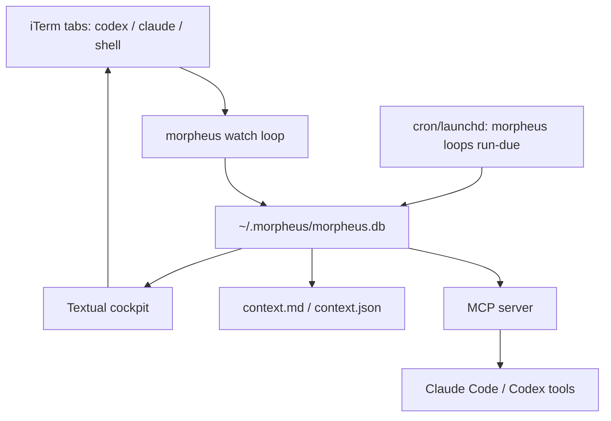

```
        ███╗   ███╗ ██████╗ ██████╗ ██████╗ ██╗  ██╗███████╗██╗   ██╗███████╗
        ████╗ ████║██╔═══██╗██╔══██╗██╔══██╗██║  ██║██╔════╝██║   ██║██╔════╝
        ██╔████╔██║██║   ██║██████╔╝██████╔╝███████║█████╗  ██║   ██║███████╗
        ██║╚██╔╝██║██║   ██║██╔══██╗██╔═══╝ ██╔══██║██╔══╝  ██║   ██║╚════██║
        ██║ ╚═╝ ██║╚██████╔╝██║  ██║██║     ██║  ██║███████╗╚██████╔╝███████║
        ╚═╝     ╚═╝ ╚═════╝ ╚═╝  ╚═╝╚═╝     ╚═╝  ╚═╝╚══════╝ ╚═════╝ ╚══════╝

                   mission graph cockpit for parallel agents
```

Morpheus is a terminal-native cockpit for running many `codex`, `claude`, and
shell sessions in iTerm without losing the plot. It watches live tabs, updates
their titles, keeps a Matrix-style dashboard, and now stores a durable mission
graph so an old session can answer: why does this exist, what happened, what is
blocked, what proof exists, and what should happen next?

## Quickstart

Requirements:

- macOS
- iTerm2
- Python 3.10+
- iTerm2 Python API enabled: `iTerm2 -> Settings -> General -> Magic -> Enable Python API`

From the repo:

```bash
cd ~/github/fabianbaier/morpheus
make start
```

`make start` does three things:

1. Creates `.venv` if needed.
2. Installs this checkout in editable mode with `pip install -e .`.
3. Installs/reloads the launchd daemon from `.venv/bin/morpheus`, then opens the
   Morpheus cockpit.

That means the command always runs the latest code you are editing in this repo,
not a stale global install.

Useful Make targets:

```bash
make start          # reload daemon, then open the cockpit
make dashboard      # open cockpit only
make daemon         # install/reload launchd watcher from this checkout
make status         # daemon health, PID, last beacon, log path
make watch          # foreground watcher instead of launchd
make graph-status   # mission graph table counts and health checks
make doctor         # iTerm2 Python API diagnostic
make logs           # tail ~/.morpheus/daemon.log
make test           # install editable, compileall, unit tests, whitespace check
```

Override the daemon poll interval when testing:

```bash
make start POLL=2
```

## Daily Use

Run the cockpit:

```bash
morpheus
```

Inside the cockpit, the left panel is a Matrix rain field made from active
sessions: recent terminal output appears as bright falling shards inside the
rain, with selected and urgent sessions rendered more prominently. The mission
table controls selection, and the right card shows the selected mission's graph
memory plus the latest terminal tail. Use `j`/`k` or arrows to move, then press
`Enter` to jump into the real iTerm tab when you need to respond directly. Use
`n` to spawn a new session without leaving Morpheus. The bottom white-rabbit
strip acts like a ticker: blocked prompts, collisions, spawns, notes,
completed-session headlines, and ready-response headlines roll in there.
Ready/completed headlines summarize the latest assistant answer block instead
of blindly using the last terminal line, so Codex prompt chrome and separator
rules do not become ticker text. The ticker renders newest-first, with the
freshest item at the top. Press `l` to create a recurring prompt loop; loop
outputs appear as ticker items and, when targeted, as graph events/artifacts for
the selected mission.

Core commands:

```bash
morpheus spawn "PR #224 review" "codex"
morpheus list
morpheus snapshot <tab-prefix>
morpheus prune
morpheus brief
morpheus ask "what needs my attention?"
morpheus graph status
morpheus graph show <mission-or-tab-prefix>
morpheus run find-prds .
morpheus run start ./PRD.md --cmd "codex"
morpheus loops add "market scan" "summarize tomorrow's market catalysts" --every 30m
morpheus loops run-due
```

Cross-session notes:

```bash
morpheus context -f short
morpheus note "touching src/auth/*, hold off"
morpheus note --kind claim "claiming PR #224 worktree"
morpheus notes -n 20
```

Suggested `AGENTS.md` / `CLAUDE.md` snippet for repos you work on in parallel:

```markdown
## Other sessions
Before editing files, run `morpheus context -f short` to see what other
agents are doing. If you would collide, post a `morpheus note --kind claim`
first or switch worktrees.
```

## Architecture



Runtime pieces:

- `morpheus/core.py` polls iTerm every few seconds, detects state, updates tab
  titles, writes context files, and records live sessions.
- `morpheus/dashboard.py` renders the Textual cockpit with Matrix rain output
  shards, mission table, selected mission card, alerts, and keyboard actions.
- `morpheus/daemon.py` installs a launchd watcher so tab titles and context stay
  fresh even when the cockpit is closed.
- `morpheus/db.py` owns SQLite storage for live session attachments, notes,
  ledgers, and the v0.7 mission graph tables.
- `morpheus/mission_graph.py` resolves mission IDs/tab IDs and provides graph
  health helpers.
- `morpheus/prd_runs.py` finds PRDs/specs and creates coordinator-led parent
  missions for v0.8 PRD Runs.
- `morpheus/loops.py` runs due prompt loops, captures output under
  `~/.morpheus/loops/`, and publishes ticker notes plus graph artifacts.
- `morpheus/context.py` writes `~/.morpheus/context.md` and `.json` so agents can
  see sibling sessions.
- `morpheus/mcp_server.py` exposes Morpheus state to Claude Code / Codex via MCP.

## Mission Graph

v0.6 tracked live tab rows in `missions`. The first v0.7 phase adds durable graph
storage:

- `missions` is now the live iTerm attachment table and includes `mission_id`.
- `mission_memory` stores durable recall fields: title, phase, why, plan, next
  step, blocker, provenance, confidence, topic, and archive state.
- `mission_events` is an append-only timeline of decisions, blockers, summaries,
  checks, archives, and resumes.
- `mission_artifacts` stores proof and outputs: snapshots, tests, builds, PRs,
  issues, docs, logs.
- `mission_edges` links missions, topics, artifacts, files, PRs, and decisions.
- `prompt_loops` and `prompt_loop_runs` store recurring prompts, due times,
  captured output, ticker summaries, and target mission routing.

Inspect it:

```bash
morpheus graph status
morpheus graph show <tab-prefix-or-mission-id>
morpheus graph event <ref> "decided to split auth tests" --kind decision
morpheus graph artifact <ref> ./pytest.log --kind test --status pass
```

Snapshots automatically attach a `snapshot` artifact to the selected mission.
When a tab is closed or disappears, the live attachment is removed but the
mission memory is archived instead of forgotten.

## PRD Runs

v0.8 starts a conservative PRD Run workflow. From the cockpit, `n` shows PRD/spec
candidates from the selected worktree; picking one creates a parent mission from
the PRD, writes a status file under `~/.morpheus/runs/<mission>/`, and spawns one
coordinator tab linked by a graph edge.

From the CLI:

```bash
morpheus run find-prds .
morpheus run start ./PRD.md --cmd "codex"
```

The coordinator is responsible for reading the PRD, proposing safe child-worker
slices, and recording status in Morpheus events/artifacts. Automatic fan-out is
intentionally not enabled yet.

## Prompt Loops

Loops are recurring prompts for periodic checks or status feeds. They are
cron-friendly: Morpheus stores the interval and routing, and launchd/cron calls
`morpheus loops run-due` often enough to execute due loops.

```bash
morpheus loops add "market scan" "summarize tomorrow's market catalysts" --every 30m
morpheus loops add "repo pulse" "what changed in this repo since last run?" --every 2h --target <mission-or-tab-prefix>
morpheus loops list
morpheus loops run-due
```

From the cockpit, press `l` to create a loop. If a mission is selected, loop
results route back to that mission as `loop_output` events and `loop-output`
artifacts; otherwise they report to the ticker/context only.

## State Files

Morpheus keeps local state under `~/.morpheus/`:

- `morpheus.db` - SQLite database
- `context.md` - live markdown snapshot for humans/agents
- `context.json` - parseable snapshot
- `morpheus.log` - foreground watcher log
- `daemon.log` - launchd daemon log
- `daemon.beacon` - heartbeat used by `morpheus daemon-status`
- `snapshots/` - transcript snapshots
- `loops/` - captured stdout/stderr from prompt loop runs

## Troubleshooting

If Morpheus cannot see iTerm tabs:

```bash
make doctor
```

Common fixes:

- Launch iTerm2.
- Enable `iTerm2 -> Settings -> General -> Magic -> Enable Python API`.
- For first run, set Python API auth to "Allow all apps to connect".
- Quit and reopen iTerm2 after changing Python API settings.

If daemon health looks stale:

```bash
make status
make logs
make daemon
```

## Roadmap

Current status: v0.8.0a5 has PRD Runs foundation, newest-first ready tickers,
prompt loops foundation, and edit mission flow.

Next implementation phases:

1. Stable mission IDs and graph storage. Done in `0.7.0a1`.
2. Mission card panel in the cockpit. Done in `0.7.0a2`.
3. Live terminal streams in the cockpit. Done in `0.7.0a3`.
4. Session-end rabbit ticker headlines. Done in `0.7.0a4`.
5. Matrix rain output shards. Done in `0.7.0a5`.
6. Robust self-tab exclusion. Done in `0.7.0a6`.
7. Ready-response rabbit ticker headlines. Done in `0.8.0a2`.
8. Newest-first rabbit ticker. Done in `0.8.0a3`.
9. Prompt loops foundation. Done in `0.8.0a4`.
10. PRD Runs foundation. Done in `0.8.0a1`.
11. Collapsible PRD run tree in the cockpit.
12. Manual child-worker spawn under a PRD run.
13. Edit mission flow for why/plan/next/provenance/proof fields. Done in `0.8.0a5`.
14. `b` brief-selected using mission graph plus transcript tail.
15. Resume-fresh flow that snapshots, archives old attachment, and spawns a new
   session linked by a `spawned_from` edge.

> "I can only show you the door. You're the one that has to walk through it."
